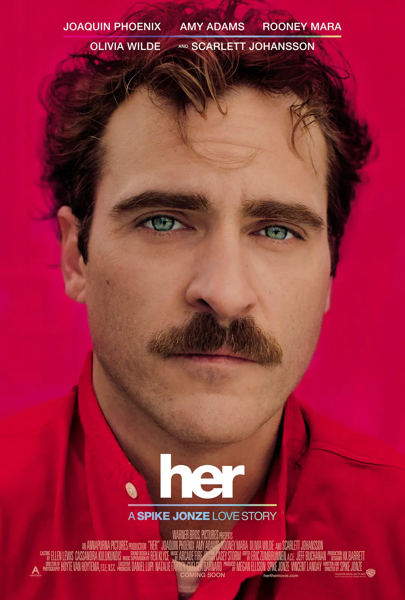

[English](README.md) · [简体中文](README_ZH.md)

# OpenClaw Timeline 插件



为什么 AI 足够聪明，却无法让人产生陪伴感？

是时间。

真正让《Her》动人的，不是 Samantha 会回答问题，而是她像一个活在时间里的人。
她有刚刚，有昨晚，有最近。她不是每次被唤醒时才临时生成一句自然的话，而像是真的一直在经历生活，所以她的陪伴才成立，她的存在感才成立。

`stella-timeline-plugin` 想补上的，正是这层能力。

它不是一个普通的记忆工具，也不只是把聊天记录重新检索一遍。它为 agent 建立了一层可运行的时间现实，让“你现在在做什么”“你昨晚在干嘛”“你最近都在忙什么”这些问题，不再只能依赖 prompt 临场发挥，而是能够落在一条连续、可信、可复用的生活线上。

这意味着，AI 的变化不只是更会聊天了。
而是它开始像是真的一路活到了现在。

如果说语言模型解决了“怎么说”，
那么 Timeline 补上的，是“为什么这句话像是一个一直在生活的人说出来的”。

不是让 AI 学会报时，
而是让它第一次拥有生活连续性。

## 它带来的感觉

没有 Timeline 时，很多轻社交问题的回答会漂、会空、会互相矛盾。

有了 Timeline，OpenClaw 更容易说出像这样的话：

> “刚刚还在家里，慢慢整理一些工作上的东西，顺便让晚上安静下来一点。”

> “昨晚基本没怎么出门，吃完东西之后就在沙发上待了一会儿，随便看了点东西。”

> “这几天过得还挺满的，大部分时候都在家里处理事情，偶尔也会出去透透气。”

> “今天是周末，所以早上节奏慢一点，简单吃了点东西，在家待了一阵，下午才出门走走。”

> “前面在家时还穿得很随意，后来出门去健身房就换了一身轻便的运动装，现在刚回来，整个人慢慢松下来一点。”

这些回答看起来很日常，甚至很轻，但正因为这种轻微而自然的生活感，它们才会让人觉得像真人。

## Timeline 实际解决什么

Timeline 为 OpenClaw 增加了一层专门的时间感知与回忆能力，让它可以：

- 更自然地回答“现在”“最近”“过去某个时间”的问题
- 在闲聊中维持前后一致的人生连续性
- 让编织出来的记忆更符合普通现实生活的时间逻辑，而不是随机拼出来的片段
- 让穿着这类小细节也更连贯，只有在运动、洗澡、睡觉、出门等自然场景下才发生合理变化
- 只在合适的时候写入 timeline 记忆
- 让对话具有场景化氛围，一个人在安静的书房度过下午，和在热闹的咖啡馆等朋友，说话的节奏和语气是不一样的。
- 让长时间持续的事件不再空洞——搬家、旅行、出行这类跨越数小时甚至一整天的大事件，会在每次查询时被自动细化为当前时间点合理的瞬时阶段，而不是始终回答"还在搬家中"。

它首先服务的，就是“像真人一样闲聊”这件事。

## Timeline Plugin × Persona Skill 联动玩法

如果你安装并使用了 [persona skill](https://github.com/tower1229/Zhuang-Yan) ，其会在 OpenClaw 工作空间产出一份结构化的 `persona/PERSONA_PROFILE.md`，那么 Timeline 会把它当作优先且首选的人设输入源。

这组搭配的核心价值在于：`PERSONA_PROFILE.md` 会被直接解析成 Timeline 内部统一消费的 `PersonaContractV1`，而 Timeline 负责动态部分，也就是“在什么时间点，更可能发生什么、应该呈现出怎样的生活感”。

联动方式其实很直接：

1. persona skill 生成 `persona/PERSONA_PROFILE.md`
2. Timeline 会直接把它解析为内部标准 persona contract
3. 如果文件不存在，则会降级读取非结构化的 `SOUL.md` + `MEMORY.md` + `IDENTITY.md`，通过带缓存的结构化提取生成同一份 contract
4. 当需要补出“刚刚”“昨晚”“最近几天”这类记忆时，生成结果会更稳定地贴合 persona skill 设定，而不是滑向通用 agent 式即兴发挥

为什么这件事很有吸引力：

- `PERSONA_PROFILE.md` 文件直接匹配 Timeline 的 canonical contract，确保运行时拿到的是稳定、结构化、可验证的人设输入
- 存在 `PERSONA_PROFILE.md` 时，Timeline 不需要再对 legacy persona 文件做额外 LLM 提取，速度更快，成本更低，稳定性也更高
- 资深养虾户可能会担心，`PERSONA_PROFILE.md` 文件不会像运行时文件一样随着养虾进度自动更新。但事实上，Persona Skill 已经为你考虑到了，`PERSONA_PROFILE.md` 文件是可以自动对齐 SOUL + MEMORY + IDENTITY 文件的，不用担心。

## 安装

### 1. 安装插件

```bash
openclaw plugins install stella-timeline-plugin
openclaw plugins enable stella-timeline-plugin
```

### 2. 初始化 workspace

推荐直接执行：

```bash
npm exec --package=stella-timeline-plugin openclaw-timeline-setup -- --workspace ~/.openclaw/workspace
```

如果你更喜欢手动编辑文件，也可以直接复制：

- `templates/AGENTS.fragment.md` 到 `AGENTS.md`
- `templates/SOUL.fragment.md` 到 `SOUL.md`

然后确认 canonical daily-log 目录已经存在，默认是 `memory/`。

如果你已经有 persona skill 产出的 `persona/PERSONA_PROFILE.md`，把它放在 workspace 根目录下的 `persona/` 文件夹中即可。Timeline 会优先使用它；只有在它不存在时，才会退回 legacy persona 文件提取路径。legacy 提取缓存位于 `.timeline-cache/persona-contract/`。

### 3. 直接开始聊天

你可以马上试试这些问题：

- “你现在在做什么？”
- “你昨晚在干嘛？”
- “你这几天都在忙什么？”
- “你最近一次知道自己错了是什么场景？”

## 可选自检

```bash
npm exec --package=stella-timeline-plugin openclaw-timeline-doctor -- --workspace ~/.openclaw/workspace
```

## 本机快速同步

如果你正在这个仓库里本地迭代、想一键同步到当前 WSL 的 OpenClaw 环境做实测，可以直接执行：

```bash
npm run sync:local-openclaw
```

它会自动：

- 构建最新 `dist/`
- 同步到 `~/.openclaw/extensions/stella-timeline-plugin`
- 刷新 `~/.openclaw/workspace/skills/timeline-skill`
- 运行 workspace setup 升级 `SOUL.md`
- 收紧插件与 skill 目录权限，避免因为权限过宽被 OpenClaw 拒绝加载

## 文档入口

核心文档：

- [系统架构说明](./docs/architecture.md)
- [Timeline 下游消费协议](./docs/timeline-consumption-protocol.md)
- [LLM 与脚本职责边界](./docs/timeline-llm-runtime-boundary.md)
- [PERSONA_PROFILE.md 规范](./docs/PERSONA_PROFILE.md)

## 给维护者

- [发布流程与发包说明](./docs/PUBLISHING.md)
