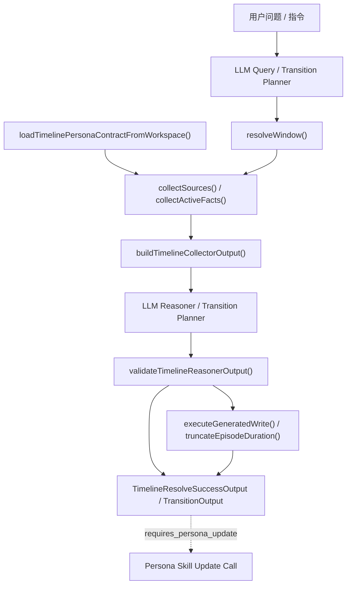
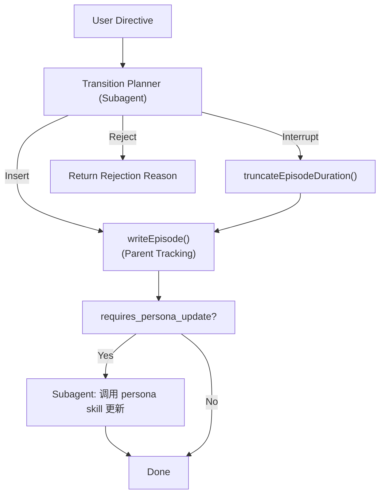
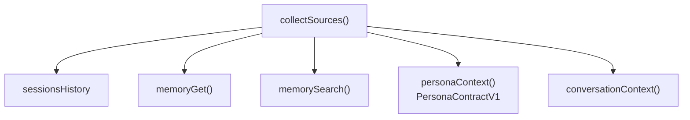

# Her Timeline 系统架构说明

> 状态：当前有效
> 目的：描述 Timeline 在 persona contract 升级后的主流程、数据边界与成功出口

---

## 1. 系统定位

Timeline 是 OpenClaw 的时间现实层。

它的职责是：

- 统一解析时间语义问题
- 按优先级检索或生成事实
- 将认定成立的事实写入 canon
- 为聊天层和下游 skill 提供稳定的结构化消费结果

一句话边界：

> LLM 负责理解、判断与组织；脚本负责约束、验证与执行。

---

## 2. 主流程总览



---

## 3. 核心流程分支

### 3.1 状态查询流程 (timeline_resolve)
标准的 T-Reality 和场景获取流程。参考第 2 节。

### 3.2 场景迁移流程 (timeline_transition)
处理用户发出的物理状态变更指令。



---

## 4. Persona Ingestion 层

Timeline 内部只承认一种 persona 真相：`PersonaContractV1`。

加载顺序：

1. `persona/PERSONA_PROFILE.md`
2. legacy `SOUL.md` / `MEMORY.md` / `IDENTITY.md`
3. empty/default contract

规则：

- 若存在 `PERSONA_PROFILE.md`，直接脚本化解析为 `PersonaContractV1`
- 若不存在，则通过独立的 legacy extraction LLM 从旧三文件提取同一份 contract
- legacy extraction 有缓存，目录默认位于 `.timeline-cache/persona-contract/`
- 下游不再消费旧式三段 persona 文本

---

## 4. 数据源收集层



事实优先级：

1. 当前 / 近邻会话硬事实
2. 已落盘 canon daily log
3. 语义记忆搜索
4. persona contract

其中 persona contract 只指导生成与合理性判断，不能改写已经成立的时间事实。

---

## 5. Collector 输出结构

```text
TimelineCollectorOutput
├── request              { user_query, mode }
├── anchor               { now, timezone }
├── window               { query_range, semantic_target, collection_scope, start, end, calendar_dates }
├── hard_facts           { sessions_history[] }
├── canon_memory         { daily_logs[] }
├── semantic_memory      { memory_search[] }
├── persona_context      { contract, available_sources, should_constrain_generation }
├── world_context        { time_band, season, hemisphere, holidays, ... }
├── conversation_context { is_recently_active, should_prefer_continuity, ... }
└── candidate_facts      CollectedTimelineFact[]
```

关键约束：

- `persona_context.contract` 是下游唯一可消费的人设输入
- collector、reasoner、guard、output builder 都不应再从 persona 文本二次提字段，也不应依赖旧式三段 persona 文本接口

---

## 6. Reasoner 与 Guard

Reasoner 负责：

- 判断是否命中已有事实
- 判断是否需要生成
- 判断连续性是否成立
- 给出结构化决策

Guard 负责：

- 校验 reasoner 输出结构
- 校验 selected fact 是否真实存在
- 校验生成结果是否允许写盘

Guard 不负责补推理，也不负责自行从候选池里挑答案。

---

## 7. 成功出口

Timeline 成功结果只有三类：

1. `reuse_existing_fact`
2. `generate_new_fact`
3. `return_empty`

写盘路径只发生在 `generate_new_fact` 且 guard 允许的情况下。

---

## 8. Persona Contract 升级后的关键收益

- persona 来源兼容被收敛在 ingestion 边界，不再污染下游
- `PERSONA_PROFILE.md` 可以直接与 persona skill 对齐
- legacy 兼容被缓存化，不需要每次都重新解析
- 下游不再依赖旧式三段 persona 字符串接口

---

## 9. 禁止退回的旧模式

以下模式不应再出现在代码或文档中：

- 旧的 core-files 入口命名
- 旧的 Timeline core context 类型
- 让下游直接依赖三段 persona 文本字段
- 从 persona prose 中再抽 `home_city` 等字段
- 把 retrieval units 当成 Timeline persona runtime 协议的一部分
