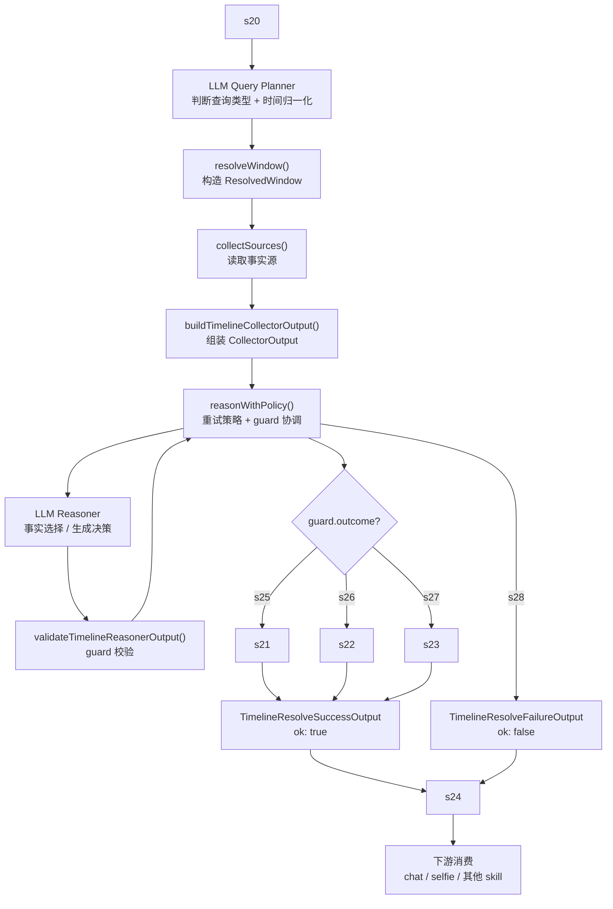
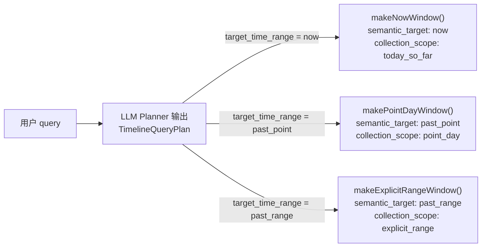
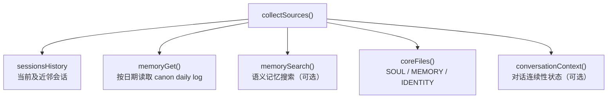
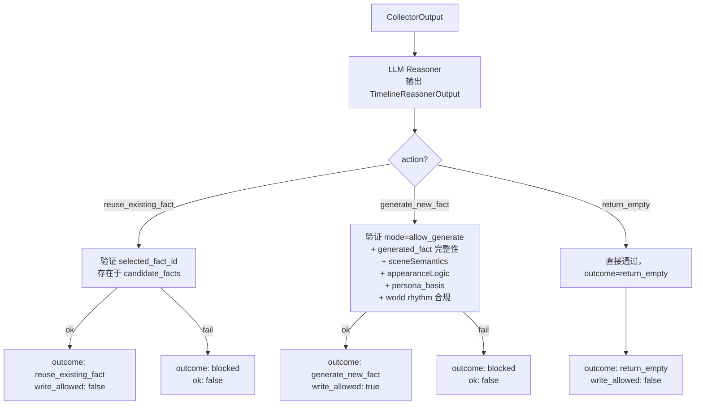
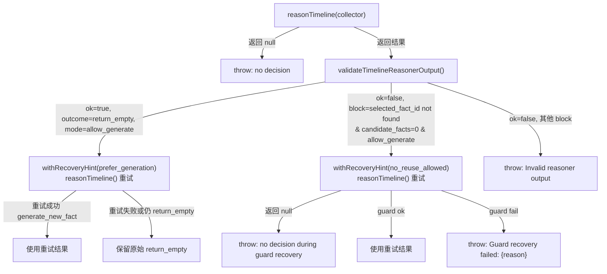
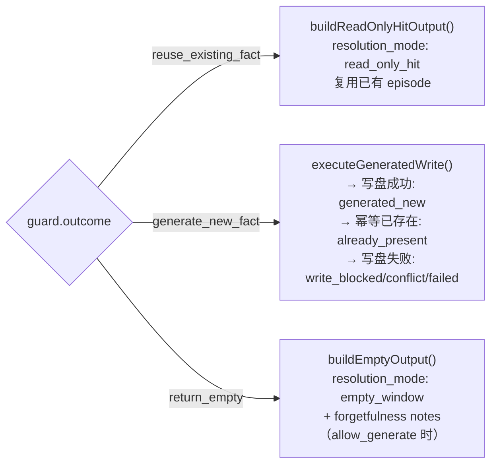
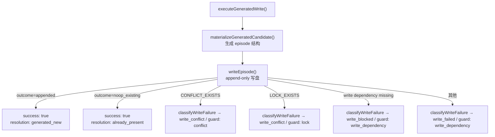
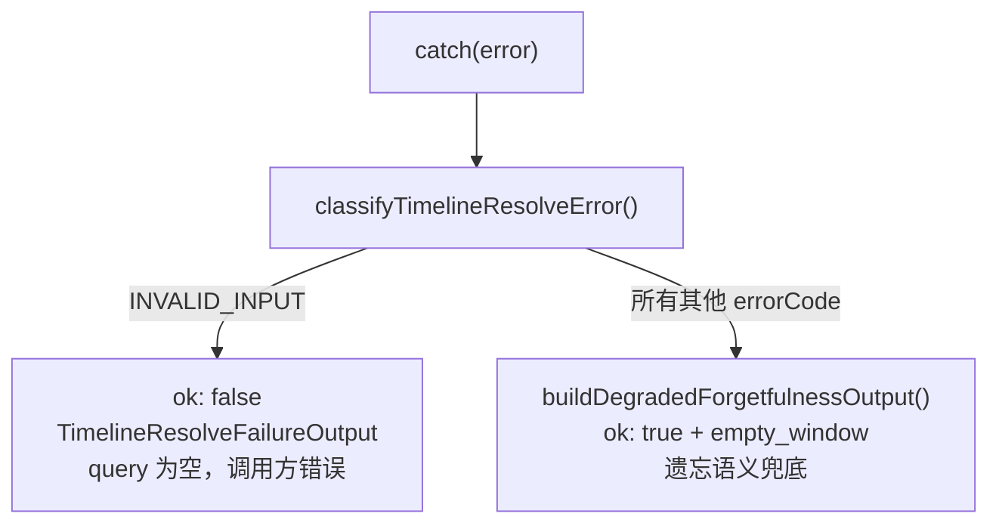

# Her Timeline 系统架构说明

> 状态：当前有效
> 目的：面向项目维护者，用架构图 + 简明说明完整描述所有逻辑分支

---

## 1. 系统定位

Timeline 是 OpenClaw 的**时间现实层**，不是一个工具演示。它的职责是：

- 统一解析时间语义问题（"你在干嘛"、"昨晚八点你在哪"）
- 按优先级检索或生成事实
- 将认定成立的事实写入 canon
- 为聊天层和下游 skill 提供稳定的消费结构

**LLM 负责理解、判断与组织；脚本负责约束、验证与执行。**

---

## 2. 主流程总览



---

## 3. 查询类型与窗口构造



查询类型只有三种，不存在第四类：

| 类型         | 语义           | 示例                                  |
| ------------ | -------------- | ------------------------------------- |
| `now`        | 此刻状态       | "你在干嘛"                            |
| `past_point` | 明确过去时间点 | "昨晚八点你在做什么"                  |
| `past_range` | 一段时间范围   | "这几天怎么样" / "最近有什么有趣的事" |

> "连续性追问"不是独立类型，而是 `now` / `past_point` 中的 reasoner 推理策略。

---

## 4. 数据源收集层



**事实优先级**（从强到弱）：

1. 当前 / 近邻会话硬事实（sessions_history）
2. 已落盘的 canon daily log（memory_get）
3. 语义记忆搜索（memory_search）
4. persona 文件（SOUL / MEMORY / IDENTITY）—— 指导生成，不能改史

---

## 5. Collector 输出结构

```
TimelineCollectorOutput
├── request            { user_query, mode }
├── anchor             { now, timezone }
├── window             { query_range, semantic_target, collection_scope, start, end, calendar_dates }
├── hard_facts         { sessions_history[] }
├── canon_memory       { daily_logs[] }
├── semantic_memory    { memory_search[] }
├── persona_context    { soul, memory, identity, should_constrain_generation }
├── world_context      { time_band, season, hemisphere, holidays, ... }
├── conversation_context { is_recently_active, should_prefer_continuity, ... }
└── candidate_facts    CollectedTimelineFact[]   ← 候选池，不是答案
```

candidate_facts 来自 canon daily log 解析后的 episode 列表，按 `fact_id: canon:{date}:{index}` 标识。

---

## 6. LLM Reasoner 与 Guard 层



Guard 只做**结构验证**，不补推理、不自选候选事实。

---

## 7. 重试策略层（reasonWithPolicy）



**两类重试，语义不同：**

- `prefer_generation`：对空窗口的柔性二次尝试，失败则保留 empty，不报错
- `no_reuse_allowed`：guard 拦截了无效 fact 引用，属于结构性错误，失败则 throw

---

## 8. 三条成功出口



### 写入路径细节



---

## 9. 错误降级策略

`try/catch` 捕获所有内部异常后，根据 `classifyTimelineResolveError` 的结果分两条路：



**降级输出结构（`ok: true`）：**

```
{
  ok: true,
  resolution_summary: { mode: 'empty_window' },
  notes: ['这段时间的事有些模糊，记不太清了。'],   ← 仅用户侧遗忘文案，不含技术错误
  trace: {
    notes: ['这段时间的事有些模糊，记不太清了。', originalErrorMessage],  ← 维护者可见
    decision: {
      resolution_mode: 'empty_window',
      error_code: errorCode,        ← 真实错误码，供维护者调试
      category: 'error_degraded'    ← 区分正常 empty_window 与降级
    }
  }
}
```

**调试路径**：调用方拿到 `ok: true` 时，可通过 `trace.decision.error_code` 非空判断是否为降级结果；`trace.notes[1]` 保存原始错误消息；trace log 文件中同样保留完整信息。

**错误分类（`classifyTimelineResolveError`）：**

| 触发场景 | errorCode | 对外行为 |
|------|------|------|
| query 为空 | `INVALID_INPUT` | `ok: false` |
| 时间范围无效 | `INVALID_RANGE` | 遗忘降级 |
| planner / reasoner 依赖缺失 | `REASONER_UNAVAILABLE` | 遗忘降级 |
| reasoner 返回 null / guard blocked | `INVALID_REASONER_OUTPUT` | 遗忘降级 |
| 其他内部异常 | `INTERNAL` | 遗忘降级 |

> 写盘失败（`WRITE_BLOCKED` / `WRITE_CONFLICT` / `WRITE_FAILED`）不进 catch 块，在主路径中由 `buildGeneratedOutput` 以 `ok: true` 处理，`resolution_summary.mode` 为对应的写盘失败模式，不走遗忘降级。

---

## 10. 下游消费结构

```
TimelineResolveSuccessOutput
├── ok: true
├── trace_id                    ← 在 try 块最开始生成，贯穿全程
├── schema_version
├── resolution_summary          { mode, writes_attempted, ... }
├── result?
│   ├── window                  { start, end, calendar_date, query_range, ... }
│   ├── episodes[]              内部事实列表（不建议下游长期依赖）
│   └── consumption             ← 下游稳定消费面
│       ├── query               { preset, semantic_target, ... }
│       ├── fact                { status, source_type, timestamp, summary, confidence }
│       ├── scene?              { location, activity, emotion_primary, appearance, city?, local_timestamp?, ... }
│       └── selfie_ready?       { location, activity, emotion, appearance, time_of_day, summary }
├── notes[]
└── trace?                      仅 input.trace=true 时返回
```

**下游只应依赖 `result.consumption`，不应直接读 `episodes[0]` 内部字段。**

---

## 11. 辅助模块一览

| 模块                      | 职责                                                                           |
| ------------------------- | ------------------------------------------------------------------------------ |
| `world_rhythm.ts`         | 推断时段（morning/afternoon/...）、季节（hemisphere-aware）、world rhythm slot |
| `country.ts`              | 从 offset 推断国家（CN/US → 节假日）、推断半球（southern offsets → 南半球）    |
| `holidays.ts`             | 按国家 + 日期查询节假日 key                                                    |
| `parse-memory.ts`         | 解析 canon daily log 文本为 ParsedEpisode 结构                                 |
| `fingerprint.ts`          | 按 date/location/action/timestamp 生成幂等 key                                 |
| `inherit-appearance.ts`   | 外观继承逻辑（从前序 episode 推断当前外观）                                    |
| `trace.ts`                | 构造 TimelineTrace，记录本次决策的完整诊断快照                                 |
| `trace_log.ts`            | 追加写入 trace 日志文件                                                        |
| `lock.ts`                 | 文件级写锁，防止并发写入冲突                                                   |
| `conversation_context.ts` | 构造对话连续性上下文（是否最近活跃、距上轮多久）                               |

---

## 12. 文件结构对照

```
src/
├── tools/
│   └── timeline_resolve.ts         主入口，协调全部流程
├── core/
│   ├── collect_sources.ts          数据源收集
│   ├── collect_timeline_request.ts 组装 CollectorOutput
│   ├── resolve_window.ts           时间窗口构造
│   ├── reason_with_policy.ts       重试策略层
│   ├── runtime_guard.ts            reasoner 输出校验
│   ├── execute_write.ts            写盘执行 + 失败分类
│   ├── build_timeline_output.ts    三条成功出口的输出构造
│   ├── build_consumption_view.ts   consumption 稳定消费视图
│   ├── materialize_generated_candidate.ts  生成结果物化
│   ├── timeline_reasoner_contract.ts       collector/reasoner 类型定义
│   ├── timeline_output_contract.ts         output 类型定义
│   ├── trace.ts                    trace 结构定义与构造
│   ├── world_rhythm.ts             世界节律推断
│   └── calendar_dates.ts           日期枚举工具
├── storage/
│   ├── write-episode.ts            append-only 写入
│   ├── daily_log.ts                canon 路径管理
│   ├── lock.ts                     文件锁
│   └── trace_log.ts                trace 日志持久化
├── lib/
│   ├── country.ts                  offset → 国家 / 半球
│   ├── holidays.ts                 节假日查询
│   ├── parse-memory.ts             daily log 解析
│   ├── fingerprint.ts              幂等 key 生成
│   ├── inherit-appearance.ts       外观继承
│   ├── time-utils.ts               时间工具函数
│   └── types.ts                    共享类型
└── runtime/
    ├── openclaw_timeline_runtime.ts  OpenClaw 运行时适配
    └── conversation_context.ts       对话上下文构造
```
