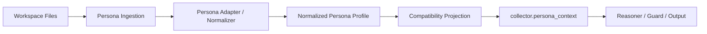

# Timeline Persona Profile Adapter Contract

> Status: proposed
> Audience: Timeline maintainers
> Depends on: [PERSONA_PROFILE.md](/mnt/c/Workspace/tower1229/Her/docs/PERSONA_PROFILE.md)
> Goal: define the Timeline-side ingestion, normalization, fallback, and compatibility contract for persona inputs.

## 1. Problem Statement

Timeline currently consumes persona signals from legacy core files:

- `SOUL.md`
- `MEMORY.md`
- `IDENTITY.md`

We want Timeline to prefer `persona/PERSONA_PROFILE.md` without breaking existing workspaces.

That means Timeline needs an ingestion layer that:

- prefers `persona/PERSONA_PROFILE.md` when available
- falls back to legacy files when it is not
- fills missing persona dimensions with safe defaults
- keeps downstream collector, reasoner, guard, and output behavior source-agnostic

## 2. Core Architecture

The recommended architecture is:



### 2.1 Hard Rule

All source-specific branching must stop before downstream collector output is assembled.

After normalization, downstream layers must not care whether persona data came from:

- `persona/PERSONA_PROFILE.md`
- legacy core files
- partial legacy files
- defaults

## 3. Recommended Module Boundary

Introduce a dedicated persona adapter module.

Suggested file names:

- `src/persona/read_persona_profile.ts`
- `src/persona/read_legacy_core_files.ts`
- `src/persona/normalize_persona_profile.ts`
- `src/persona/project_persona_context.ts`

Exact names may vary, but responsibility separation should remain clear.

### 3.1 Responsibility Split

`read_persona_profile`

- loads raw `persona/PERSONA_PROFILE.md`
- parses structured sections
- returns explicit structured persona data plus raw text

`read_legacy_core_files`

- loads `SOUL.md`, `MEMORY.md`, `IDENTITY.md`
- records presence, raw text, and extraction candidates

`normalize_persona_profile`

- merges preferred source with fallback inputs
- applies weak inference and safe default completion
- produces one normalized internal object

`project_persona_context`

- converts the normalized internal object into the existing downstream `persona_context` compatibility surface

## 4. Internal Contract

Timeline should add a richer internal contract than the current `TimelineCoreContext`.

Suggested shape:

```ts
interface NormalizedPersonaProfile {
  source_kind: 'persona_profile' | 'legacy_core_files' | 'mixed' | 'defaults_only';
  source_detail: string[];
  provenance: {
    meta: 'explicit_profile' | 'legacy_explicit' | 'weak_inference' | 'defaulted';
    identity: 'explicit_profile' | 'legacy_explicit' | 'weak_inference' | 'defaulted';
    soul: 'explicit_profile' | 'legacy_explicit' | 'weak_inference' | 'defaulted';
    memory: 'explicit_profile' | 'legacy_explicit' | 'weak_inference' | 'defaulted';
    rhythm: 'explicit_profile' | 'legacy_explicit' | 'weak_inference' | 'defaulted';
    appearance: 'explicit_profile' | 'legacy_explicit' | 'weak_inference' | 'defaulted';
    scene_anchors: 'explicit_profile' | 'legacy_explicit' | 'weak_inference' | 'defaulted';
    constraints: 'explicit_profile' | 'legacy_explicit' | 'weak_inference' | 'defaulted';
  };
  should_constrain_generation: boolean;
  meta: {
    schema_version?: string;
    persona_id?: string;
    home_city?: string;
    home_country?: string;
    home_timezone?: string;
    primary_language?: string;
  };
  identity: {
    life_stage?: string;
    living_style?: string;
    base_environment?: string;
    common_zones: string[];
    mobility_radius?: string;
    occupation_style?: string;
    routine_context: string[];
  };
  soul: {
    temperament?: string;
    emotional_style?: string;
    social_style?: string;
    cognitive_style?: string;
    values: string[];
    aesthetic_bias?: string;
  };
  memory: {
    long_term_habits: string[];
    long_term_preferences: string[];
    durable_commitments: string[];
    recurring_patterns: string[];
    important_non_temporal_facts: string[];
  };
  rhythm: {
    weekday_bias: string[];
    weekend_bias: string[];
    morning_bias: string[];
    afternoon_bias: string[];
    evening_bias: string[];
    late_night_bias: string[];
  };
  appearance: {
    default_home_style?: string;
    default_outing_style?: string;
    default_exercise_style?: string;
    appearance_priority: string[];
    change_triggers: string[];
    non_triggers: string[];
    style_constraints: string[];
  };
  scene_anchors: {
    plausible_locations: string[];
    plausible_activities: string[];
    rare_but_possible_scenes: string[];
    implausible_or_rare_locations: string[];
    implausible_or_rare_activities: string[];
  };
  constraints: {
    must: string[];
    should: string[];
    avoid: string[];
  };
  retrieval_units: Array<{
    id: string;
    type: 'identity' | 'soul' | 'memory' | 'rhythm' | 'appearance' | 'scene' | 'constraint';
    priority: 'high' | 'medium' | 'low';
    summary: string;
  }>;
  raw_text: {
    persona_profile?: string;
    soul?: string;
    memory?: string;
    identity?: string;
  };
}
```

This object is intentionally richer than the current collector contract.

It exists to improve ingestion quality while preserving downstream compatibility.

## 5. Compatibility Projection

The current collector expects:

```ts
interface TimelineCoreContext {
  soul: string;
  memory: string;
  identity: string;
  available_sources: string[];
  should_constrain_generation: boolean;
}
```

Timeline may keep this downstream shape during migration.

### 5.1 Projection Rule

The adapter must project the normalized profile into three compatibility strings:

- `soul`
- `memory`
- `identity`

These are not file reads anymore.

They are synthesized compatibility views of the normalized persona profile.

### 5.2 Recommended Projection Strategy

`identity`

- geographic anchors
- life stage
- living style
- base environment
- common zones
- occupation style

`soul`

- temperament
- emotional style
- social style
- values
- aesthetic and experiential bias

`memory`

- long-term habits
- long-term preferences
- recurring patterns
- durable commitments
- appearance tendencies
- selected scene anchors
- constraint rules

### 5.3 Why Projection Is Better Than Direct Refactor

This lets Timeline:

- preserve existing collector output shape
- avoid a large one-shot prompt refactor
- add `persona/PERSONA_PROFILE.md` incrementally
- evolve downstream contracts later if needed

## 6. Source Priority And Merge Policy

### 6.1 Priority Order

1. explicit structured `persona/PERSONA_PROFILE.md`
2. explicit legacy file content
3. weak inference from legacy text
4. defaults

### 6.2 Merge Rule

If `persona/PERSONA_PROFILE.md` exists, it is the primary semantic source.

Legacy files may supplement only when:

- the profile omits a dimension entirely
- the supplement does not conflict with explicit profile content

### 6.3 Conflict Rule

When profile and legacy files disagree:

- explicit profile wins
- legacy content must not silently override it
- an optional trace note may record the conflict for maintainers

## 7. Default Completion Policy

Missing data must be filled conservatively.

Default completion should reduce model drift without fabricating strong autobiography.

### 7.1 Acceptable Defaults

- empty array for absent optional lists
- neutral appearance continuity assumptions
- no explicit rare-scene bans unless supported by source
- no explicit social pattern unless supported by source

### 7.2 Unacceptable Defaults

- inventing a home city
- inventing exercise as a recurring hobby
- inventing strong clothing preferences
- inventing strong social aversions or commitments
- inventing stable relationships

### 7.3 Constraint Flag Rule

`should_constrain_generation` should be true if any meaningful persona signals were found beyond defaults.

It should be false only when normalization is essentially empty and default-driven.

## 8. Legacy Extraction Policy

Legacy extraction should be weakly helpful, not aggressively interpretive.

### 8.1 Good Legacy Extraction

From legacy prose:

- "She lives in Shanghai" -> identity anchor
- "She often works from her home study" -> recurring pattern
- "She likes exercise" -> preference or plausible activity
- "She prefers quiet cafes" -> plausible location preference

### 8.2 Bad Legacy Extraction

From vague prose:

- "She is expressive" -> formal outing clothing logic
- "She likes going out" -> frequent nightlife bias
- "She is reflective" -> bookstore as a hard default scene

### 8.3 Rule Of Thumb

Weakly infer only what reduces obvious nonsense.

Do not infer details that materially narrow the persona without explicit textual support.

## 9. Adapter Output Invariants

The adapter must guarantee:

1. downstream always receives a complete `TimelineCoreContext`
2. `available_sources` truthfully reflects the upstream source kind
3. `should_constrain_generation` is set consistently
4. source absence never crashes the collector
5. defaults do not masquerade as strong explicit persona facts

### 9.1 Recommended `available_sources`

During migration, these values should remain compatible with existing semantics:

- `soul`
- `memory`
- `identity`

If `persona/PERSONA_PROFILE.md` is used, Timeline may still expose all three if the compatibility projection produced all three views.

If maintainers want richer provenance, add internal trace fields rather than changing downstream consumer meaning immediately.

## 10. Downstream Non-Impact Rule

The following layers should not branch on persona source kind:

- collector assembly
- reasoner prompt builder
- guard validation
- output construction
- write path

Only the adapter layer should branch on file presence and source format.

## 11. Prompting Guidance During Migration

The reasoner may continue consuming:

- `collector.persona_context.soul`
- `collector.persona_context.memory`
- `collector.persona_context.identity`

But Timeline maintainers should gradually improve prompt quality by:

- ensuring the projected strings preserve structure
- surfacing constraints clearly
- including enough scene anchors to reduce generic generation

If later desired, a versioned contract migration may expose richer structured persona sections directly to the reasoner.

That should be a separate deliberate change, not bundled into the first adapter rollout.

## 12. Suggested Implementation Order

1. Add `persona/PERSONA_PROFILE.md` spec support in a new adapter module.
2. Add legacy file reader and weak extractor.
3. Add normalized internal persona profile type.
4. Add compatibility projection to current `TimelineCoreContext`.
5. Wire `coreFiles()` to the adapter instead of direct file reads.
6. Add tests for priority, fallback, defaults, and conflict handling.
7. Only after stability, consider richer downstream structured persona contracts.

## 13. Testing Requirements

The adapter should be covered by dedicated tests.

### 13.1 Required Cases

- profile only
- legacy only
- profile plus legacy with no conflict
- profile plus legacy with conflict
- partial legacy files
- empty workspace persona inputs
- weak inference extraction
- defaults-only behavior

### 13.2 Required Assertions

- normalized profile provenance
- compatibility projection shape
- `should_constrain_generation` correctness
- stable downstream `persona_context`
- no invented hard claims in defaults-only mode

### 13.3 Integration Cases

At least one end-to-end Timeline generation test should verify:

- `persona/PERSONA_PROFILE.md` can drive persona-consistent generation
- legacy files still work unchanged
- same downstream reasoner path behaves correctly for both

## 14. Trace And Debugging

Maintain an internal trace-friendly summary, even if not user-visible.

Recommended debug fields:

- source kind
- source files found
- sections parsed
- weak inferences applied
- defaults applied
- conflict resolutions

This is especially useful while migrating real user workspaces.

## 15. Suggested Future Evolution

Once the adapter is stable, Timeline may later expose a richer persona contract downstream, for example:

- structured appearance constraints
- structured scene anchor sets
- retrieval-unit citations

But that evolution should happen only after:

- compatibility rollout succeeds
- profile format stabilizes
- legacy fallback behavior is proven safe

## 16. Final Rule

Treat persona ingestion as a compatibility and normalization problem at the boundary, not as a reasoner concern.

If this rule is preserved, Timeline can support both the new persona profile world and the legacy OpenClaw workspace world without contaminating downstream logic.
