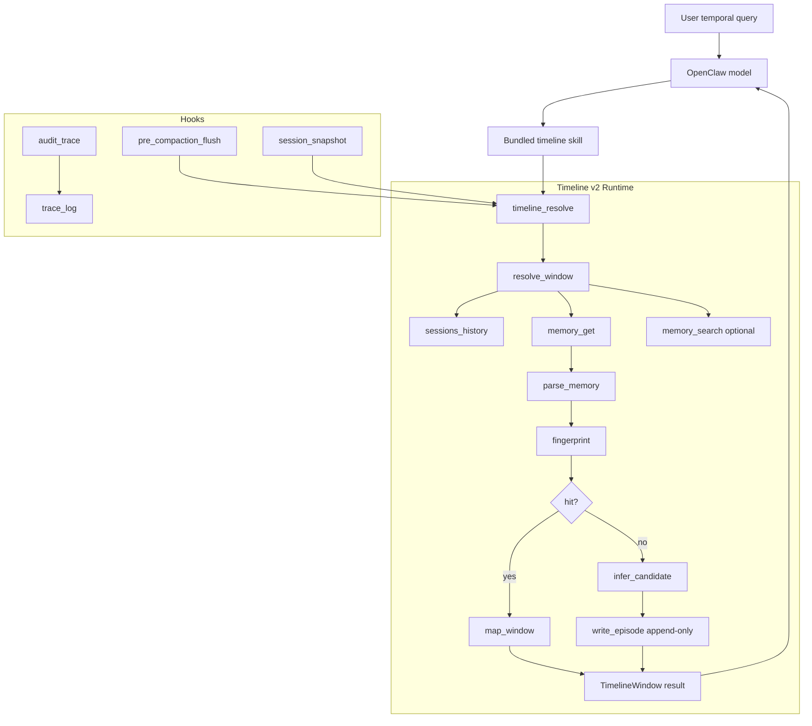

# Timeline v2.0 Refactor Plan for OpenClaw

> Status: implementation memo
> Goal: provide a development-ready refactor plan for evolving the current prompt-only timeline skill into a deterministic OpenClaw plugin runtime
> Audience: maintainers and implementers

## 1. Target Outcome

Timeline v2.0 should deliver the following end state:

1. **One canonical execution entrypoint**: `timeline_resolve`
2. **One canonical write path** for append-only timeline persistence
3. **Deterministic resolution pipeline** implemented in code
4. **Prompt layers reduced to routing only**
5. **Lifecycle hooks for flush / snapshot / audit**
6. **Traceability for every timeline run**
7. **Backward-compatible Markdown daily logs** in the near term

## 2. Non-Goals for v2.0

The following are explicitly out of scope for v2.0 unless later phases prove them necessary:

- replacing OpenClaw's global memory plugin slot;
- replacing OpenClaw's context engine;
- inventing a brand-new memory file format;
- rewriting historical daily logs in place;
- building a full UI for timeline inspection.

## 3. Product Requirements

### 3.1 Functional requirements

Timeline v2.0 must:

- answer temporal queries for `now_today`, `recent_3d`, and `explicit` ranges;
- read facts in the order `sessions_history -> memory_get -> memory_search`;
- parse existing Markdown daily logs into structured episodes;
- deduplicate via soft fingerprinting;
- inherit appearance deterministically;
- emit `TimelineWindow` / `Episode` JSON;
- append a new canonical entry only when generation is allowed and no hit exists;
- produce run traces.

### 3.2 Operational requirements

Timeline v2.0 should:

- install as a normal OpenClaw plugin;
- ship a bundled timeline skill;
- minimize or eliminate manual AGENTS / SOUL editing;
- fail safely under low-confidence conditions;
- support developer debugging through logs and trace IDs.

## 4. v2.0 Architecture Summary

### 4.1 Architecture snapshot

The repository should be understood as a layered OpenClaw plugin runtime:

- **bundled skill** for temporal routing;
- **`timeline_resolve` tool** as the canonical execution entrypoint;
- **core runtime pipeline** for parsing, deduplication, generation, and mapping;
- **storage helpers** for append-only writes, locks, and traces;
- **hooks** for flush / snapshot / audit lifecycle behavior.



### 4.2 Layers

#### Layer A — Bundled Skill

Purpose:
- detect temporal intent;
- route the model to `timeline_resolve`;
- tell the model how to consume the tool result.

This layer must not own algorithmic behavior.

#### Layer B — Plugin Tool Runtime

Purpose:
- execute the deterministic timeline pipeline;
- own structured output;
- own canonical write decisions.

This is the heart of v2.0.

#### Layer C — Hooks

Purpose:
- flush current state before compaction/reset;
- snapshot useful state at lifecycle boundaries;
- persist audit traces.

#### Layer D — Storage Helpers

Purpose:
- isolate Markdown reads/writes;
- isolate trace storage;
- optionally add lock/guard behavior for single-writer enforcement.

## 5. Repository / Package Layout

Recommended target layout:

```text
openclaw-timeline/
├── openclaw.plugin.json
├── index.ts
├── skills/
│   └── timeline/
│       └── SKILL.md
├── src/
│   ├── tools/
│   │   ├── timeline_resolve.ts
│   │   ├── timeline_status.ts
│   │   └── timeline_repair.ts
│   ├── hooks/
│   │   ├── pre_compaction_flush.ts
│   │   ├── session_snapshot.ts
│   │   └── audit_trace.ts
│   ├── core/
│   │   ├── resolve_window.ts
│   │   ├── collect_sources.ts
│   │   ├── parse_memory.ts
│   │   ├── fingerprint.ts
│   │   ├── infer_candidate.ts
│   │   ├── inherit_appearance.ts
│   │   ├── map_window.ts
│   │   ├── write_episode.ts
│   │   ├── trace.ts
│   │   └── types.ts
│   ├── adapters/
│   │   ├── sessions_history.ts
│   │   ├── memory_get.ts
│   │   └── memory_search.ts
│   └── storage/
│       ├── daily_log.ts
│       ├── trace_log.ts
│       └── lock.ts
└── docs/
    ├── timeline-v2-refactor-plan.md
    ├── timeline-openclaw-architecture.md
    ├── timeline-openclaw-plugin-diagram.md
    └── timeline-resolve-interface.md
```

## 6. Core Runtime Contract

### 6.1 Main tool

Tool name:

```text
timeline_resolve
```

Responsibilities:
- normalize user intent into a window;
- collect source facts;
- resolve read-only hit vs generated_new;
- write append-only canon when policy allows;
- return structured JSON plus trace metadata.

### 6.2 Supporting tools

#### `timeline_status`
Purpose:
- debug the current timeline runtime state;
- expose last trace and write metadata.

#### `timeline_repair`
Purpose:
- validate malformed daily logs;
- rebuild derived state if a shadow index is later added;
- report corruption.

This tool must not silently rewrite canon.

## 7. Deterministic Pipeline Specification

Every `timeline_resolve` call should run this pipeline in order:

1. **Resolve window**
   - parse `target_time_range` / `query` / `start` / `end`;
   - compute anchor time and effective timezone.
2. **Collect hard anchor**
   - call `sessions_history` first.
3. **Collect deterministic disk state**
   - call `memory_get` for each affected calendar day.
4. **Collect supporting semantic context**
   - call `memory_search` only when additional recall context is needed.
5. **Parse disk content**
   - convert Markdown to `ParsedEpisode[]`.
6. **Attempt read-only reuse**
   - run soft fingerprint matching.
7. **Generate candidate only if needed**
   - only when no fingerprint hit exists and mode allows generation.
8. **Apply appearance inheritance**
   - inherit by day anchor unless change signals override.
9. **Map result**
   - build `Episode` / `TimelineWindow`.
10. **Write append-only canon**
    - only when `generated_new` and runtime policy permits.
11. **Emit trace**
    - record sources touched, decisions, confidence, and writes.
12. **Return structured payload**
    - no natural-language reply generation inside the tool.

## 8. Module-by-Module Work Breakdown

### 8.1 `resolve_window.ts`

Implement:
- preset parsing;
- explicit range validation;
- natural-language to preset/range normalization;
- timezone handling;
- multi-day splitting.

Acceptance criteria:
- deterministic `window.start` / `window.end` for all supported inputs;
- explicit rejection of malformed ranges.

### 8.2 `collect_sources.ts`

Implement:
- strict ordering of `sessions_history`, then `memory_get`, then optional `memory_search`;
- source fetch telemetry;
- fallback handling.

Acceptance criteria:
- traces always show source order;
- semantic search is never used to skip hard-anchor reads.

### 8.3 `parse_memory.ts`

Port / reuse the current parser, but package it for runtime use.

Enhancements:
- support multi-day batch parsing;
- standardize parse warnings;
- expose raw segment metadata for debugging.

Acceptance criteria:
- existing Level A / Level B tests keep passing;
- malformed segments generate warnings, not silent data loss.

### 8.4 `fingerprint.ts`

Port / reuse current logic.

Enhancements:
- include trace-friendly comparison output;
- record matched episode metadata.

Acceptance criteria:
- same 30-minute bucket normalization remains stable;
- read-only hits are explainable from traces.

### 8.5 `infer_candidate.ts`

New module.

Purpose:
- produce a conservative candidate episode when no hit exists;
- merge hard-anchor facts with persona-safe low-confidence inference.

Acceptance criteria:
- does not contradict `sessions_history`;
- exposes confidence reasons;
- never fabricates rich detail when evidence is weak.

### 8.6 `inherit_appearance.ts`

Port current logic into runtime and expose trace fields:
- day anchor source;
- whether override happened;
- reason / matched signal.

Acceptance criteria:
- inheritance occurs in code, never by prompt-only instruction.

### 8.7 `map_window.ts`

Implement:
- mapping from parsed/generated episodes to `TimelineWindow`;
- multi-day aggregation;
- resolution summary construction.

Acceptance criteria:
- output schema is stable and tool-friendly;
- consumers can read `resolution.mode`, `episodes`, and confidence fields directly.

### 8.8 `write_episode.ts`

Port current writer and strengthen it:
- input validation;
- append-only write;
- canonical path checks;
- optional lock guard.

Acceptance criteria:
- refuses writes with missing required fields;
- never overwrites existing segments.

### 8.9 `trace.ts`

New module.

Implement:
- `trace_id` generation;
- source touch logs;
- write attempt logs;
- confidence summary;
- error/fallback notes.

Acceptance criteria:
- every successful or failed run has a trace record.

## 9. Hook Design

### 9.1 `pre_compaction_flush.ts`

Trigger condition:
- before compaction or equivalent session flush boundary.

Behavior:
- invoke `timeline_resolve` with `target_time_range=now_today`, `mode=allow_generate`, and `reason=compaction_flush`.

Acceptance criteria:
- flushes state through the same runtime path used by normal queries;
- does not bypass timeline logic.

### 9.2 `session_snapshot.ts`

Trigger condition:
- session boundary events such as reset / new / archive, depending on what OpenClaw exposes.

Behavior:
- persist a lightweight snapshot or at minimum a trace marker.

Acceptance criteria:
- useful for debugging continuity failures.

### 9.3 `audit_trace.ts`

Trigger condition:
- after each timeline tool invocation or on a plugin-defined audit event.

Behavior:
- persist trace summaries to an append-only log sink.

Acceptance criteria:
- makes it easy to answer whether timeline logic truly ran.

## 10. AGENTS / SOUL Migration Plan

### v1 problem

The current shape relies on AGENTS / SOUL templates to make timeline behavior happen.
That is acceptable for routing guidance, but not for correctness-critical logic.

### v2 rule

- **AGENTS.md** should no longer carry the full memory protocol needed for timeline correctness.
- **SOUL.md** may keep a short reminder for temporal routing during transition.
- The bundled skill becomes the primary prompt-level integration surface.
- The plugin runtime becomes the correctness layer.

### Acceptance criteria

- plugin install + bundled skill should be sufficient for normal use;
- any manual AGENTS / SOUL edits should be optional and short.

## 11. Single Writer Hardening Plan

### Phase 1

Document and route all canonical writes through `timeline_resolve` / `write_episode`.

### Phase 2

Add storage guards:
- canonical-path check;
- optional lock file;
- trace logging for all write attempts.

### Phase 3

If OpenClaw permissions allow it, reduce or block direct generic writes to canonical
 timeline paths by non-timeline components.

## 12. Testing Plan

### 12.1 Unit tests

Add / keep tests for:
- range normalization;
- parser Level A / B behavior;
- fingerprint bucket logic;
- appearance inheritance;
- write validation;
- trace emission.

### 12.2 Integration tests

Add tests for:
- `timeline_resolve(read_only)` hit path;
- `timeline_resolve(allow_generate)` write path;
- hard-anchor conflict preference;
- multi-day `recent_3d` behavior;
- hook-triggered flush behavior.

### 12.3 Manual scenario tests

Run end-to-end scenarios such as:
- "what are you doing right now?"
- "where were you yesterday afternoon?"
- repeated same-window questions;
- low-confidence empty-window fallback;
- compaction flush followed by replay.

## 13. Milestone Plan

### Milestone 1 — Plugin skeleton

Deliverables:
- `openclaw.plugin.json`
- plugin entrypoint
- bundled skill
- stub `timeline_resolve`

Definition of done:
- plugin installs and registers tool successfully.

### Milestone 2 — Core runtime path

Deliverables:
- resolve window
- source collection
- parser integration
- fingerprint integration
- output mapping

Definition of done:
- `read_only_hit` path works end-to-end.

### Milestone 3 — Generation and writing

Deliverables:
- candidate inference
- appearance inheritance
- append-only writer
- trace emission

Definition of done:
- `generated_new` path works safely and observably.

### Milestone 4 — Hook integration

Deliverables:
- pre-compaction flush hook
- session snapshot hook
- audit trace hook

Definition of done:
- lifecycle events use the same canonical runtime path.

### Milestone 5 — Hardening

Deliverables:
- storage guards
- better diagnostics
- repair/status tools
- documentation updates

Definition of done:
- timeline failures are diagnosable without reading model prose.

## 14. Acceptance Checklist

Timeline v2.0 is acceptable only if all are true:

- [ ] temporal queries use a real tool, not prompt-only simulation
- [ ] source read order is enforced in code
- [ ] read-only hit is decided by fingerprint logic in code
- [ ] appearance inheritance is decided in code
- [ ] append-only writes happen only through timeline-owned paths
- [ ] every run has a trace ID and trace record
- [ ] bundled skill is sufficient for routing in normal installations
- [ ] AGENTS / SOUL edits are optional and minimal
- [ ] Markdown daily logs remain compatible
- [ ] lifecycle hooks do not bypass the core tool runtime

## 15. Recommended First Sprint

If the team wants the highest-leverage first sprint, implement exactly this:

1. plugin skeleton
2. `timeline_resolve` stub
3. `resolve_window.ts`
4. `collect_sources.ts`
5. current `parse-memory.ts` + `fingerprint.ts` reuse
6. `map_window.ts`
7. `trace.ts`
8. bundled skill rewrite

Why this sprint first:
- it proves the architecture without solving every hard generation problem at once;
- it moves timeline from prompt simulation to deterministic read-only retrieval;
- it gives immediate observability.

## 16. Recommended Second Sprint

Implement:

1. `infer_candidate.ts`
2. `inherit_appearance.ts` runtime integration
3. `write_episode.ts` hardening
4. pre-compaction flush hook
5. write trace sink

Why second:
- generation/write behavior is where correctness risk is highest;
- by this point the read-only path and traces should already be stable.

## 17. Final Recommendation

Proceed with a **plugin-first v2.0 refactor** using a bundled skill, a canonical
`timeline_resolve` tool, lifecycle hooks, and append-only Markdown compatibility.

Do **not** spend v2.0 scope on memory-plugin or context-engine replacement work.
Those can be evaluated only after the deterministic tool runtime has been proven in
production-like use.
